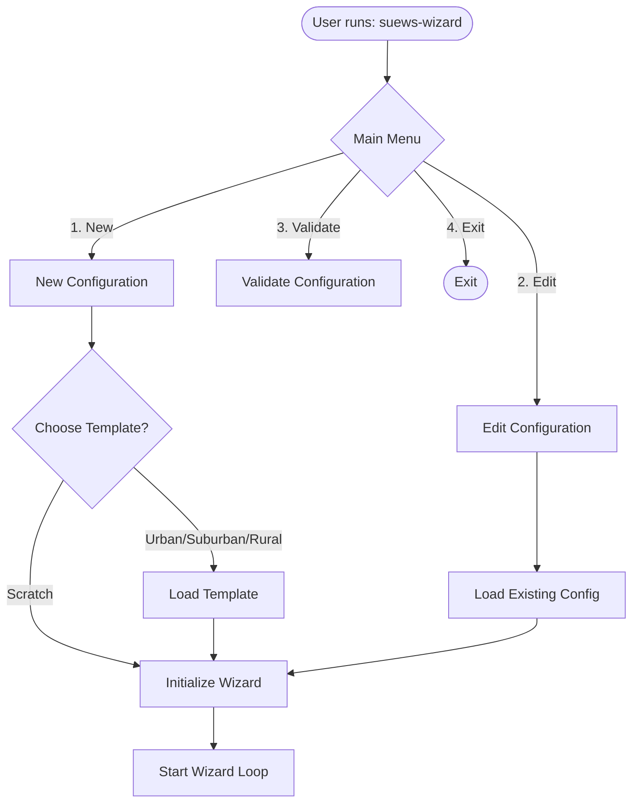
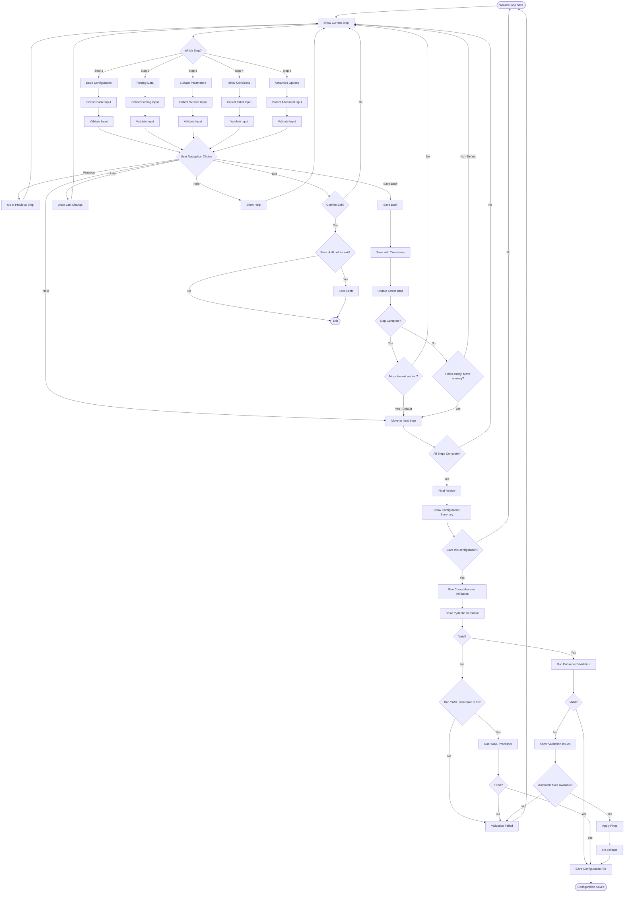
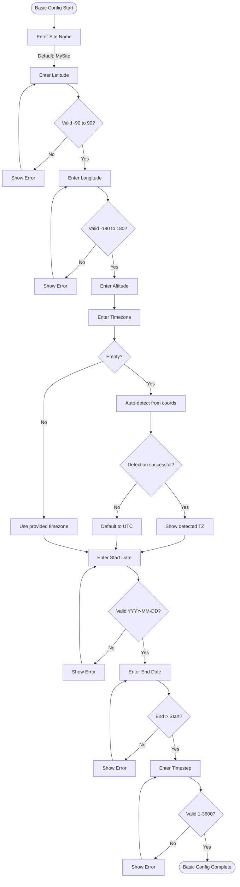
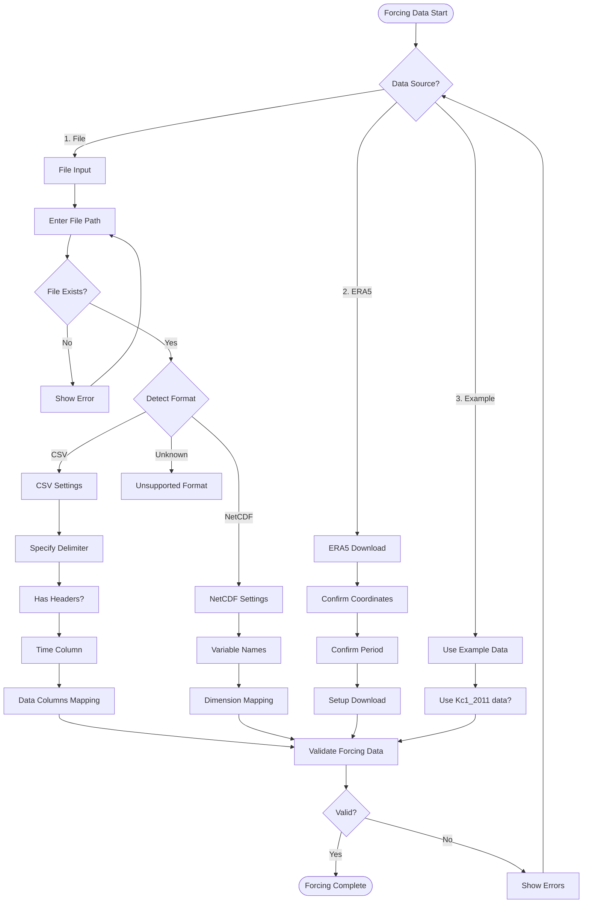
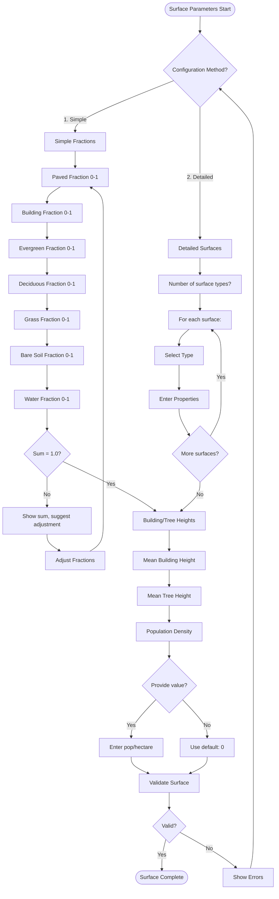
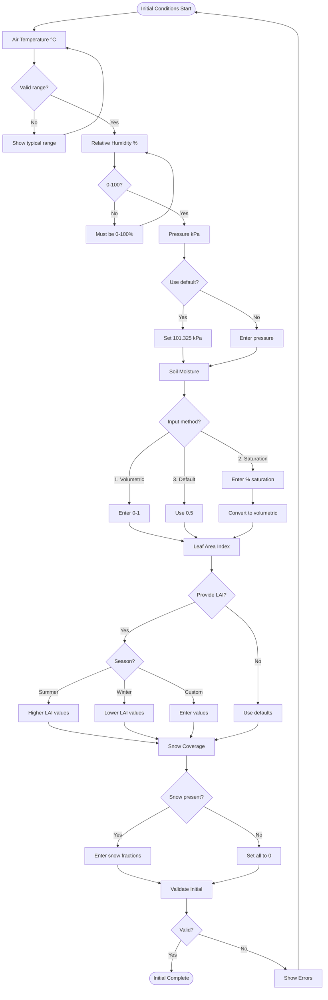
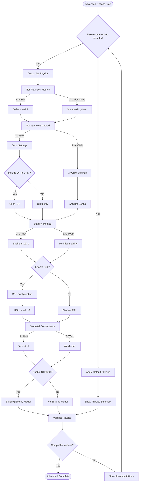
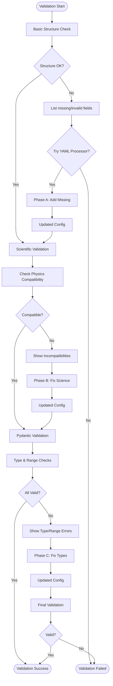
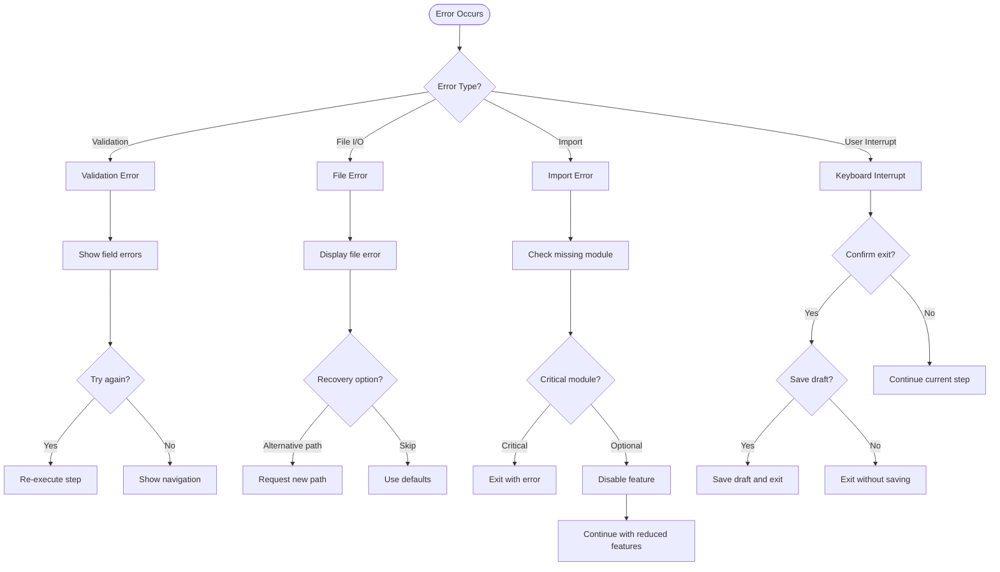

# SUEWS Configuration Wizard - Technical Workflow Documentation

## Overview
The SUEWS Configuration Wizard is an interactive CLI tool that guides users through creating YAML configuration files for SUEWS urban climate simulations. This document details the complete workflow, decision trees, and user interaction flow.

## Architecture Components

### Core Components
1. **WizardEngine** (`engine.py`) - Main orchestrator
2. **WizardSession** (`utils/state.py`) - State management
3. **WizardStep** (`steps/base.py`) - Base class for all steps
4. **Validators** (`validators/`) - Configuration validation
5. **CLI Interface** (`cli.py`) - Entry point and commands

## Main Workflow



## Wizard Loop Workflow



## Step-by-Step Decision Trees

### Step 1: Basic Configuration



### Step 2: Forcing Data Configuration



### Step 3: Surface Parameters



### Step 4: Initial Conditions



### Step 5: Advanced Options



## Validation Workflow



## Draft Management

```mermaid
flowchart TD
    SaveDraft([Save Draft Triggered]) --> CreateTimestamp[Generate Timestamp]
    CreateTimestamp --> CreateFilename[Create draft_YYYYMMDD_HHMMSS.yaml]
    
    CreateFilename --> SaveTimestamped[Save Timestamped Draft]
    SaveTimestamped --> SaveLatest[Save as .yaml.draft]
    
    SaveLatest --> ShowSaved[Display: Draft saved to X]
    ShowSaved --> ShowLatest[Display: Also saved as .yaml.draft]
    
    ShowLatest --> CheckComplete{is_complete()?}
    CheckComplete --> |True| PromptAdvance1[This section complete. Move to next?]
    CheckComplete --> |False| ShowIncomplete[Some fields empty]
    
    ShowIncomplete --> PromptAdvance2[Move to next anyway?]
    
    PromptAdvance1 --> |Yes - Default| AdvanceStep[current_step++]
    PromptAdvance1 --> |No| StayOnStep[Stay on current]
    
    PromptAdvance2 --> |Yes| AdvanceStep
    PromptAdvance2 --> |No - Default| StayOnStep
    
    AdvanceStep --> ContinueWizard([Continue Wizard])
    StayOnStep --> ContinueWizard
```

## Error Recovery



## State Management

### Session State Structure
```yaml
session:
  current_step: 0-4  # Current wizard step index
  configuration:     # User's configuration data
    site:
      name: str
      latitude: float
      longitude: float
      altitude: float
      timezone: str
    simulation:
      start_date: str
      end_date: str
      timestep: int
    forcing:
      source: str
      file_path: str
      # ... other forcing options
    surface:
      method: str
      fractions: dict
      heights: dict
    initial_conditions:
      air_temperature: float
      relative_humidity: float
      pressure: float
      soil_moisture: float
    advanced_options:
      netradmethod: int
      ohmmethod: int
      gsmodel: int
      # ... other physics options
  validation_errors: dict  # Field -> [error messages]
  undo_stack: list         # Previous states for undo
```

## User Interaction Patterns

### Input Collection Pattern
1. Show field description/help
2. Display current/default value
3. Accept user input
4. Validate immediately
5. Show validation feedback
6. Store if valid / retry if invalid

### Navigation Pattern
- **[N]ext**: Advance to next step (default)
- **[P]revious**: Go back to previous step
- **[S]ave draft**: Save current progress
- **[U]ndo**: Revert last change (if available)
- **[H]elp**: Show contextual help
- **[E]xit**: Exit wizard (with confirmation)

### Validation Feedback Pattern
- ✅ Green checkmark for valid input
- ❌ Red X for errors with specific message
- ⚠️ Yellow warning for non-critical issues
- 💡 Suggestions for fixing problems

## Configuration Output

### Final YAML Structure
```yaml
_metadata:
  created_by: "SUEWS Configuration Wizard"
  version: "1.0"
  
site:
  name: "MySite"
  latitude: 51.5074
  longitude: -0.1278
  altitude: 0.0
  timezone: "Europe/London"

simulation:
  start_date: "2023-01-01"
  end_date: "2023-12-31"
  timestep: 300

forcing:
  source: "file"
  file_path: "data/forcing.csv"
  # Additional forcing configuration

surface:
  method: "simple_fractions"
  fractions:
    paved: 0.4
    building: 0.2
    evergreen_tree: 0.05
    deciduous_tree: 0.1
    grass: 0.2
    bare_soil: 0.05
    water: 0.0
  heights:
    building_mean: 10.0
    tree_mean: 5.0

initial_conditions:
  air_temperature: 10.0
  relative_humidity: 70.0
  pressure: 101.325
  soil_moisture: 0.5

advanced_options:
  netradmethod: 1
  ohmmethod: 1
  ohmincqf: 1
  gsmodel: 2
  stebbsmethod: 0
  # Additional physics options
```

## Decision Points for User Feedback

### Key Questions for Review:

1. **Workflow Flow**
   - Should draft saves always prompt for advancement?
   - Should validation run after each step or only at the end?
   - Should undo functionality be per-field or per-step?

2. **Default Behaviors**
   - What should be the default template (scratch/urban/suburban/rural)?
   - Should advanced options default to recommended or require explicit choice?
   - Should incomplete sections block progression or allow skipping?

3. **Validation Strategy**
   - When should enhanced validation (YAML processor) run automatically?
   - Should validation fixes be applied automatically or require confirmation?
   - How strict should validation be during wizard vs. final save?

4. **User Experience**
   - Should there be a "quick mode" with all defaults?
   - Should there be inline help or separate help screens?
   - Should progress be shown as percentage or step numbers?

5. **Error Handling**
   - Should errors block progression or allow continuation?
   - Should warnings be shown immediately or collected for review?
   - How many retry attempts before offering to skip?

6. **Data Persistence**
   - Should drafts be auto-saved periodically?
   - How many historical drafts should be kept?
   - Should there be a recovery mode for interrupted sessions?

## Proposed Enhancements

1. **Smart Defaults**
   - Location-based defaults using coordinate lookup
   - Season-aware initial conditions
   - Template refinement based on usage patterns

2. **Validation Improvements**
   - Real-time validation as user types
   - Cross-field dependency checking
   - Physics compatibility matrix

3. **User Guidance**
   - Progress indicator with time estimate
   - Context-sensitive suggestions
   - Example values for each field

4. **Import/Export**
   - Import from existing SUEWS config files
   - Export to different formats
   - Configuration comparison tool

Please review this workflow documentation and provide feedback on:
- Which decision paths should be changed
- What defaults should be different
- Where the flow could be simplified
- What validation should be stricter/looser
- Any missing functionality or steps