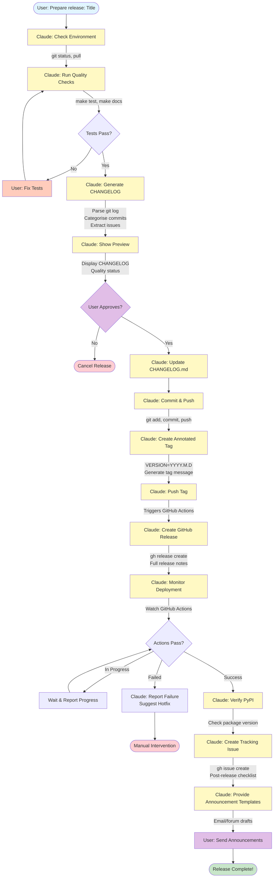

# SUEWS Release Manual

> **Purpose**: This manual provides comprehensive guidelines for SUEWS releases, from development through publication.
> **Audience**: Core developers, release managers, and contributors.
> **Last Updated**: 14 October 2025

## Executive Summary

SUEWS adopts a **rolling release model** that reflects the continuous nature of research software development while providing stable reference points for academic citations.

**Key Principles:**
- **Release when ready**, not by calendar
- **No fixed schedules** or promises about release dates
- **Continuous development** with daily `.dev` builds
- **Feature-triggered releases** when significant work is complete
- **Academic citation support** via Zenodo DOI for each tagged release

## TL;DR: Quick Release Guide

**To release SUEWS:**

1. **Pre-flight**: `make test && make docs` (both pass)
2. **CHANGELOG**: Add entry for today's date with changes
3. **Tag**:
   ```bash
   VERSION="2025.10.14"
   git tag -a "$VERSION" -m "Release Title

   Key changes:
   - Feature 1
   - Feature 2"
   git push origin $VERSION
   ```
4. **Wait ~20 min**: GitHub Actions builds **two versions** in parallel:
   - `2025.10.14` (standard, NumPy ≥2.0)
   - `2025.10.14rc1` (UMEP/QGIS, NumPy 1.x)

   Both deployed to PyPI → GitHub Release → Zenodo DOI
5. **Verify**: Check [Actions](https://github.com/UMEP-dev/SUEWS/actions), [PyPI](https://pypi.org/project/supy/), [Zenodo dashboard](https://zenodo.org/me/uploads)
6. **Announce**: [UMEP Discussions](https://github.com/UMEP-dev/UMEP/discussions) (optional)

**Everything else is automatic.** See below for detailed guidance.

---

## Dual-Build System: Standard + UMEP

Every SUEWS release automatically creates **two PyPI versions** from a single git tag:

| Version Type | Version | NumPy | Target Users |
|--------------|---------|-------|--------------|
| Standard | `2024.10.7` | ≥2.0 | Standalone Python users |
| UMEP | `2024.10.7rc1` | 1.x | QGIS/UMEP plugin users |

### pip Install Behavior

- `pip install supy` → Gets `2024.10.7` (standard, NumPy 2.0)
- `pip install supy==2024.10.7rc1` → Gets `2024.10.7rc1` (UMEP, NumPy 1.x)
- rc1 is a pre-release tag, automatically skipped by pip unless explicitly specified

### Why Two Versions?

**Background**: QGIS 3.40 LTR ships with NumPy 1.26.4. NumPy 2.0 introduced ABI breaks requiring separate binary builds.

**Solution**: Automatic parallel builds from single tag:
- **Standard build** uses NumPy ≥2.0 for modern Python environments
- **UMEP build** uses `oldest-supported-numpy` and NumPy 1.x for QGIS compatibility
- Both run in parallel (~20 minutes total)
- No manual coordination needed

### UMEP Integration

UMEP requirements file specifies:
```python
supy==2024.10.7rc1
```

UMEP users run:
```bash
pip install -r umep-requirements.txt
```

They never see version details - it just works.

**Why rc1?**
- rc1 = "release candidate 1" (PEP 440 pre-release tag)
- pip skips pre-releases by default
- Ensures `pip install supy` gets the standard version (2024.10.7)
- UMEP users get rc1 via explicit pin in requirements

### What Happens Automatically

From a single tag push:

1. **Standard Build** (`build_wheels` job)
   - Builds wheels with NumPy ≥2.0
   - Creates version `2024.10.7`
   - Deployed to PyPI

2. **UMEP Build** (`build_umep` job)
   - Modifies `pyproject.toml` at build time:
     - Build: `oldest-supported-numpy` (instead of `numpy>=2.0`)
     - Runtime: `numpy>=1.22,<2.0` (instead of `numpy>=2.0`)
   - Sets `BUILD_UMEP_VARIANT=true` environment variable
   - Creates version `2024.10.7rc1` (via `get_ver_git.py`)
   - Binary compatible with NumPy 1.26.4 (QGIS 3.40 LTR)
   - Deployed to PyPI

3. **Deployment** (`deploy_pypi` job)
   - Waits for both build jobs
   - Collects wheels from both
   - Publishes all wheels to PyPI together

**Timeline**: Both builds run in parallel (~20 minutes total)

**See Also**:
- `.github/workflows/build-publish_to_pypi.yml` - CI configuration with detailed comments
- `get_ver_git.py` - Version string logic including rc1 suffix
- GitHub issue #724 - Original UMEP compatibility discussion

---

## Automated Release Workflow



**Legend:**
- 🔵 Blue: User initiates
- 💛 Yellow: Claude Code automated (12 steps)
- 💜 Purple: User decisions (2 touch points)
- 🧡 Orange: User fixes if needed
- 🟢 Green: Success
- 🔴 Red: Cancelled/Failed

**Time: ~5 minutes with Claude Code** (vs 35 minutes manual)

**Usage:** Ask Claude Code: "Prepare release: [Title]"

## 1. Version Format

```
YYYY.M.D[.dev]
```

- **YEAR**: Full year (e.g., 2025)
- **MONTH**: Month of release (1-12)
- **DAY**: Day of release (1-31)
- **.dev**: Optional suffix for development builds

### Examples
- **Development build**: `2025.8.8.dev` (daily/continuous)
- **Tagged release**: `2025.8.15` (when feature is ready)

## 2. Release Philosophy

### Rolling Release Model

#### No Fixed Schedule
- Release when features are complete and tested
- No artificial deadlines or quarterly promises
- No pressure to meet calendar dates

#### Continuous Development
- Daily development builds continue as normal
- Every commit to master gets a `.dev` tag
- Development is transparent and continuous

#### Feature-Triggered Releases
When something significant is ready:
1. Remove `.dev` suffix from that day's version
2. Create GitHub release with descriptive title
3. Add release notes explaining the significance
4. Zenodo automatically assigns DOI for citation

### Example Timeline
```
2025.8.8.dev   → Daily development
2025.8.9.dev   → More development
2025.8.10.dev  → Feature complete
2025.8.10      → Tagged release: "Improved Snow Physics"
2025.8.11.dev  → Development continues
2025.8.15      → Tagged release: "Bug fixes for extreme events"
2025.8.16.dev  → Development continues
```

## 3. What Triggers a Release?

### Release When:
- ✅ **Significant feature** is complete and tested
- ✅ **Important bug fixes** that users need
- ✅ **Before conferences** for presentations
- ✅ **Collaborators need** a stable reference
- ✅ **Paper submissions** requiring specific version
- ✅ **Teaching needs** stable version for semester

### NOT Because:
- ❌ It's the first Tuesday of the month
- ❌ We promised a Q2 release
- ❌ It's been X weeks since last release
- ❌ Calendar says it's release day

## 4. Release Naming & Communication

The version number is just the date. The **significance** comes from descriptions:

### GitHub Release Title
```
2025.8.15: Improved Snow Module
2025.9.3: Critical Fix for QF Calculations
2025.10.1: New Anthropogenic Heat Methods
```

### Git Tag Message
```bash
git tag -a 2025.8.15 -m "Improved Snow Module

- Enhanced snow accumulation physics
- Fixed snow melt energy balance
- Added new snow density parameterisation"
```

### Changelog Entry
```markdown
## 2025.8.15 - Improved Snow Module
- [feature] Enhanced snow accumulation physics
- [feature] New snow density parameterisation
- [bugfix] Fixed snow melt energy balance
```

## 5. Distribution & Citation

### Distribution Channels

#### PyPI (Python Package Index)
- **Tagged releases**: Published immediately
- **Dev builds**: Daily, marked as pre-release
- **Installation**:
  - Stable: `pip install supy`
  - Dev: `pip install --pre supy`


#### GitHub Releases
- Source tarballs
- Release notes with meaningful titles
- Binary wheels for major platforms

### Academic Citation

#### Zenodo DOI
> **Status**: ✅ Active and configured. See Appendix D for details.

**Automatic features**:
- Each tagged release receives a unique DOI
- Permanent archival for reproducibility
- Machine-readable metadata with all 12 authors and ORCIDs
- Citations include proper academic attribution

#### Citation Format
```
SUEWS dev team (2025). SUEWS v2025.8.15: Improved Snow Module.
Zenodo. https://doi.org/10.5281/zenodo.XXXXXXX
```

#### BibTeX Entry
```bibtex
@software{suews_2025_8_15,
  author       = {SUEWS dev team},
  title        = {SUEWS: Surface Urban Energy and Water Balance Scheme},
  month        = 8,
  year         = 2025,
  version      = {2025.8.15},
  doi          = {10.5281/zenodo.XXXXXXX},
  url          = {https://github.com/UMEP-dev/SUEWS}
}
```

## 6. Quality Assurance

### Before Any Release
- ✅ All tests pass (`make test`)
- ✅ Documentation builds (`make docs`)
- ✅ Changelog updated
- ✅ Clean working directory

### Testing Levels
- **Every commit**: CI/CD automated tests
- **Before release**: Full test suite locally
- **Optional beta**: Share dev build for testing if needed

## 7. Practical Workflows

### Daily Development
```bash
# Normal development
git commit -m "Add feature X"
git push
# Automatic: Creates 2025.8.8.dev on PyPI
```

### Creating a Release
```bash
# When feature is ready and tested
git tag -a 2025.8.15 -m "Improved Snow Module

- Feature description
- Bug fixes
- Breaking changes (if any)"

git push origin 2025.8.15

# This triggers:
# - GitHub release creation
# - PyPI upload (without .dev)
# - Zenodo DOI assignment
```

### Post-Release
```bash
# Development continues immediately
git commit -m "Start next feature"
# Automatic: 2025.8.16.dev
```

## 8. Documentation Strategy

### Documentation Principles
- Documentation travels with code
- Each tagged release has corresponding docs
- Development builds use latest documentation
- Version switcher on ReadTheDocs

### Documentation Updates
- Inline during development
- Review before tagging release
- Can update after release if needed

## 9. Breaking Changes

### Handling Breaking Changes
- **Clear communication** in release title: "Breaking: API Changes"
- **Migration guide** in release notes
- **No special timing** - release when ready
- **Deprecation warnings** when possible (but not required)

### Example
```
2025.10.5: Breaking: New Configuration Format
- Old format still works with warning
- Migration guide included
- Will remove old format support in future (no specific date)
```

## 10. Benefits of Rolling Release

### For Developers
- No release deadline stress
- Natural development rhythm
- Release when quality is right
- No artificial feature freezes

### For Users
- Transparent development (daily progress visible)
- Features available when ready
- Clear communication about changes
- Can pin to specific versions for stability

### For Academia
- Every tagged version is citable (DOI)
- No waiting for quarterly releases
- Reproducible research with specific versions
- Stable versions available when needed for teaching


## 11. Step-by-Step Release Guide

### Pre-Release Preparation

#### 1. Decide if Release is Needed
Ask yourself:
- Is there a significant feature complete?
- Are there critical bug fixes users are waiting for?
- Is a stable version needed for teaching/conference/paper?

If yes to any → proceed with release.

#### 2. Prepare Your Environment
```bash
# Ensure on master branch
git checkout master
git pull origin master

# Ensure clean working directory
git status  # Should be clean
```

#### 3. Run Quality Checks
```bash
# Run full test suite
make test

# Build documentation
make docs

# Check for any deprecation warnings
python -W all -m pytest test/
```

### Creating the Release

#### 4. Update CHANGELOG.md
```bash
vim CHANGELOG.md
```

Add entry under current date:
```markdown
### 15 Aug 2025
- [feature] Brief description of main feature ([#XXX](github.com/UMEP-dev/SUEWS/issues/XXX))
  - Detailed point 1
  - Detailed point 2
- [bugfix] Fixed issue with... ([#YYY](github.com/UMEP-dev/SUEWS/issues/YYY))
- [change] Breaking change if any

**Note**: This release includes both `2025.8.15` (NumPy 2.0) and `2025.8.15rc1` (NumPy 1.x for UMEP/QGIS).
```

#### 5. Commit Changes
```bash
git add CHANGELOG.md
git commit -m "docs: update changelog for 2025.8.15 release"
git push origin master
```

#### 6. Create Git Tag
```bash
# Format: YYYY.M.D (no leading zeros for month/day)
VERSION="2025.8.15"
TITLE="Improved Snow Module"  # Short, descriptive title

git tag -a "$VERSION" -m "$TITLE

Key changes:
- Enhanced snow accumulation physics
- Fixed snow melt energy balance
- Added new snow density parameterisation

Breaking changes:
- None (or list them)

See CHANGELOG.md for full details."
```

#### 7. Push Tag to GitHub
```bash
git push origin $VERSION
```

This automatically triggers:
- GitHub Actions build & test
- PyPI package upload
- GitHub Release creation
- Zenodo DOI assignment (automatic within ~10 min)

### Post-Release Tasks

#### 8. Verify Release
- Check [GitHub Actions](https://github.com/UMEP-dev/SUEWS/actions)
- Verify on [PyPI](https://pypi.org/project/supy/)
- Check [GitHub Releases](https://github.com/UMEP-dev/SUEWS/releases) for new release
- Wait ~10 minutes, then check [Zenodo dashboard](https://zenodo.org/me/uploads) for new deposit
  - New DOI will be assigned automatically
  - All 12 authors will appear with ORCIDs
  - Existing DOI: 10.5281/zenodo.11164910 (previous release)

#### 9. Update GitHub Release (if needed)
GitHub Releases are created automatically by the workflow. However, you can edit to:
1. Go to [GitHub Releases](https://github.com/UMEP-dev/SUEWS/releases)
2. Find your release
3. Click "Edit release"
4. Add Zenodo DOI badge once available (usually appears automatically)
5. Add any additional notes or links

#### 10. Announce Release (Optional)
- SUEWS mailing list
- UMEP forum
- Social media if major feature

### Troubleshooting

#### If Tests Fail After Tagging
```bash
# Delete local tag
git tag -d $VERSION

# Delete remote tag
git push origin --delete $VERSION

# Fix issue, then retag
```

#### If PyPI Upload Fails
- Check GitHub Actions logs
- Verify PyPI credentials in repository secrets
- Manual upload: `python -m build && twine upload dist/*`

#### Dual-Build Issues

**Q: What if one build fails?**
A: Deployment proceeds with available wheels. Independent builds mean one failure doesn't block the other.

**Q: How to verify both versions are on PyPI?**
A: Check PyPI release history:
```bash
pip index versions supy
# Should show both 2025.8.15 and 2025.8.15rc1
```

**Q: UMEP users reporting NumPy 2.0 conflict?**
A: Verify UMEP requirements file specifies rc1 version exactly: `supy==2025.8.15rc1`

**Q: Version ordering on PyPI?**
A: `2025.8.15rc1` sorts before `2025.8.15` but after `2025.8.14`. Latest stable version preferred by pip unless exact version specified.

**Q: How to test before production release?**
A: Use test tag (e.g., `v2025.10.test`) to trigger builds and check TestPyPI.

## 13. Release Decision Matrix

| Scenario | Action | Example |
|----------|--------|---------|
| Major feature complete | Tag release | New physics module ready |
| Critical bug fix | Tag release immediately | Calculation error affecting results |
| Minor bug fixes accumulated | Consider release | 5+ small fixes over 2 weeks |
| Conference/paper deadline | Tag release if stable | Team needs citable version |
| Teaching semester starting | Tag release | Stable version for students |
| Only minor tweaks | Keep as dev | Documentation typos, code cleanup |
| Experimental feature | Keep as dev | Not ready for production |

## 14. FAQ

**Q: How often will releases happen?**
A: When features are ready. Could be weekly, monthly, or longer gaps.

**Q: What if I need a stable version for teaching?**
A: Use any tagged release (without .dev). We can tag a release before semester if needed.

**Q: How do I know what changed?**
A: Check GitHub releases page - each release has a descriptive title and notes.

**Q: Can I request a release?**
A: Yes, if you need a stable version for a paper/conference, let us know.

**Q: What about long-term support?**
A: No formal LTS, but older versions remain on PyPI/Zenodo indefinitely.

**Q: Why do I see rc1 versions on PyPI?**
A: These are UMEP/QGIS-compatible builds with NumPy 1.x. They're automatically created for every release but hidden from `pip install` by default. UMEP users get them via pinned requirements.

**Q: Should I document rc1 versions in release notes?**
A: No. Release notes describe features/changes. Both versions have identical source - only dependency differs. GitHub workflow handles this automatically.

## Appendix A: Quick Reference Card

### Release in 5 Minutes
```bash
# 1. Ensure tests pass
make test

# 2. Update changelog
vim CHANGELOG.md

# 3. Create tag with meaningful message
git tag -a 2025.8.15 -m "Title: Brief description

- Detail 1
- Detail 2"

# 4. Push tag
git push origin 2025.8.15

# 5. Verify on GitHub/PyPI/Zenodo
```

### Communication Templates

#### Email/Forum Announcement
```
SUEWS v2025.8.15 Released: Improved Snow Module

Install: pip install --upgrade supy
Details: https://github.com/UMEP-dev/SUEWS/releases/tag/2025.8.15
Cite: https://doi.org/10.5281/zenodo.XXXXXXX

Key changes:
- Enhanced snow physics
- Fixed energy balance bug
- Improved performance
```

---

## Appendix B: Technical Details

### GitHub Actions Workflow
The release workflow (`build-publish_to_pypi.yml`) triggers on tags:
- Builds wheels for all platforms
- Runs test suite
- Uploads to PyPI if tests pass
- Creates GitHub release draft

### Zenodo Integration (Not Yet Configured)
Once set up:
- Repository linked via GitHub-Zenodo integration
- DOI assigned automatically on release
- Metadata from GitHub repository
- Authors from `.zenodo.json` if present

### Version Resolution
Version determined by `get_ver_git.py`:
- Tags without .dev → formal release
- Commits after tag → adds .dev suffix
- Used by build system automatically

## Appendix C: Roles & Permissions

### Who Can Release?
- **Core team**: Full release permissions
- **Contributors**: Can suggest via PR
- **Release manager**: Designated person for major releases

### Required Permissions
- GitHub: Push tags to repository
- PyPI: Maintainer access (automated via GitHub Actions)
- Zenodo: Automatic via GitHub integration

## Appendix D: Zenodo Integration Setup & Verification

### Current Status
✅ `.zenodo.json` metadata file created in repository (12 authors with ORCIDs)
✅ GitHub Actions workflow creates releases automatically
✅ Zenodo-GitHub integration enabled (toggle ON)
✅ Webhook active and ready for next release

### Setup Completed

Integration is now active. The setup included:

1. **Zenodo-GitHub Link** ✅
   - Repository enabled at https://zenodo.org/account/settings/github/
   - Toggle switched to ON
   - Existing DOI: 10.5281/zenodo.11164910

2. **Webhook Verified** ✅
   - Active at https://github.com/UMEP-dev/SUEWS/settings/hooks
   - Webhook URL: `https://zenodo.org/api/hooks/receivers/github/events/`
   - Listening for release events

3. **Metadata Configured** ✅
   `.zenodo.json` in repository root with:
   ```json
   {
     "creators": [
       {"name": "Sun, Ting", "orcid": "0000-0000-0000-0000"},
       {"name": "Grimmond, Sue"},
       {"name": "Ward, Helen"},
       {"name": "Omidvar, Hamidreza"}
     ],
     "license": "GPL-3.0",
     "title": "SUEWS: Surface Urban Energy and Water Balance Scheme",
     "keywords": ["urban climate", "energy balance", "hydrology", "meteorology"]
   }
   ```

### Testing the Integration

After enabling, test with next release:

1. **Push a tag** (e.g., `git push origin 2025.10.8`)
2. **Wait for workflow** to complete (~15 minutes)
3. **Check GitHub Release** is created automatically
4. **Check Zenodo** (within 5-10 minutes):
   - Visit your Zenodo dashboard: https://zenodo.org/me/uploads
   - New deposit should appear with the release
   - DOI will be assigned automatically
5. **Verify DOI badge** appears in GitHub Release

### Troubleshooting

**No DOI appearing?**
- Check Zenodo webhook is active in GitHub settings
- Verify repository toggle is ON in Zenodo
- Check Zenodo upload dashboard for errors
- Releases (not just tags) trigger Zenodo

**DOI not in GitHub Release?**
- DOI badge is added manually or via Zenodo badge API
- Can edit release to add: `[](https://doi.org/10.5281/zenodo.XXXXX)`

### Benefits
- Automatic DOI for every release
- Permanent archive (even if GitHub goes down)
- Professional citations for academic papers
- Version-specific DOIs for reproducibility

## Appendix E: Beta/RC Testing Process

### When to Use Beta/RC Releases

**Release Candidates (RC)** are recommended for:
- Major feature releases with significant API changes
- Breaking changes that need user validation
- Releases before conferences/teaching semesters
- When you want feedback before final release

### RC Release Process

#### 1. Create RC Tag
```bash
VERSION="2025.10.8"
RC="rc1"

# Note: No separator between version and rc (PEP 440 compliant)
git tag -a "${VERSION}${RC}" -m "Release Candidate 1 for $VERSION

This is a release candidate for testing. Do not use in production.

Key changes:
- Feature 1
- Feature 2

Testing focus:
- Please test X functionality
- Verify Y behaviour
- Check Z compatibility"

git push origin ${VERSION}${RC}
```

#### 2. Deploy to PyPI as Pre-Release
RC releases automatically deploy to PyPI as pre-releases (via GitHub Actions):
```bash
# Install latest RC (pre-release)
pip install --pre supy

# Install specific RC version
pip install supy==2025.10.8rc1
```

**Note**: RC versions are marked as pre-releases on PyPI. Users must use `--pre` flag to install them.

#### 3. Announce for Testing
```markdown
SUEWS v2025.10.8rc1 Released for Testing

Install: pip install --pre supy
Or specific version: pip install supy==2025.10.8rc1
Duration: 1-2 weeks testing period
Focus: [Areas needing testing]
Feedback: GitHub issues or mailing list
```

#### 4. Collect Feedback
- Monitor GitHub issues
- Track mailing list discussions
- Direct communication with beta testers

#### 5. Iterate or Release
- **If issues found**: Fix, tag rc2, repeat
- **If stable**: Proceed with normal release process (tag without -rc)

### Beta Testing Program (Optional)

For major releases, consider:
- Recruit beta testers from user community
- Create beta testing channel (Discord/Slack)
- Provide testing guidelines and checklists
- Recognise beta testers in release notes

## Appendix F: Hotfix and Patch Release Process

### Patch Version Format

For critical post-release bugs:
```
YYYY.M.D.PATCH
```

Examples:
- `2025.10.8` (original release)
- `2025.10.8.1` (first patch)
- `2025.10.8.2` (second patch)

### When to Create Patch Release

**Immediate patch required for:**
- Security vulnerabilities
- Data corruption bugs
- Critical calculation errors
- Installation failures

**Can wait for next regular release:**
- Minor UI issues
- Documentation errors
- Non-critical warnings
- Performance improvements (unless severe)

### Hotfix Workflow

#### 1. Create Hotfix Branch (Optional)
For complex fixes:
```bash
git checkout -b hotfix/2025.10.8.1 2025.10.8
# Make fixes
# Test thoroughly
```

For simple fixes, work directly on master.

#### 2. Fast-Track Testing
```bash
# Minimal but essential testing
make test
# Focus testing on affected functionality
pytest test/specific_test.py -v
```

#### 3. Update CHANGELOG
Add under original release date:
```markdown
### 8 Oct 2025
- [feature] Original feature

#### Patch 2025.10.8.1 (9 Oct 2025)
- [bugfix] CRITICAL: Fixed security vulnerability in... ([#XXX](link))
```

#### 4. Tag and Release
```bash
VERSION="2025.10.8.1"

git tag -a "$VERSION" -m "HOTFIX: Critical bug in calculation

Fixes:
- [SECURITY] Fixed vulnerability allowing...
- [CRITICAL] Fixed data corruption in...

Users on 2025.10.8 should upgrade immediately.

See CHANGELOG.md for details."

git push origin $VERSION
```

#### 5. Emergency Communication
```markdown
URGENT: SUEWS v2025.10.8.1 Hotfix Released

Install: pip install --upgrade supy
Affected: Users on v2025.10.8
Impact: [Description of bug impact]
Fix: [What was fixed]
Action: Upgrade immediately via pip install --upgrade supy
```

### Hotfix vs Regular Release Decision Matrix

| Severity | Impact | Response Time | Release Type |
|----------|--------|---------------|--------------|
| Critical security | All users | Immediate | Hotfix patch |
| Data corruption | All users | Same day | Hotfix patch |
| Calculation error | Research results | 1-2 days | Hotfix patch |
| Installation failure | New users | 1-2 days | Hotfix patch |
| Minor bug | Some users | Next release | Regular release |
| Performance issue | Inconvenience | Next release | Regular release |

## Appendix G: Post-Release Monitoring

### Immediate Post-Release (First 24-48 Hours)

#### 1. Deployment Verification Checklist
- [ ] GitHub Actions completed successfully
- [ ] Package appears on PyPI with correct version
- [ ] Test installation: `pip install --upgrade supy`
- [ ] Verify version: `python -c "import supy; print(supy.__version__)"`
- [ ] Check documentation builds on ReadTheDocs

#### 2. Monitor Key Channels
- **GitHub Issues**: Watch for new issues tagged with version
- **PyPI Statistics**: Check download counts (via pypistats)
- **Mailing List**: Monitor for installation/usage problems
- **CI/CD Logs**: Review any post-release build failures

#### 3. Quick Smoke Tests
Run basic sanity checks:
```bash
# Install in fresh environment
uv venv .venv-test && source .venv-test/bin/activate
pip install supy

# Run minimal test
python -c "
import supy as sp
# Basic functionality check
print('Import successful')
# Add version-specific smoke test
"
```

### First Week Monitoring

#### 4. Track Adoption
```bash
# PyPI download statistics (requires pypistats)
pypistats recent supy

# GitHub traffic
# Check repository insights for:
# - Clone/download activity
# - Issue creation rate
# - Discussion activity
```

#### 5. Issue Triage
- **Priority 1**: Security, data corruption, installation failures → Hotfix
- **Priority 2**: Calculation errors, major bugs → Investigate immediately
- **Priority 3**: Minor bugs, feature requests → Schedule for next release

#### 6. User Feedback Collection
Create feedback issue:
```markdown
## Feedback: SUEWS v2025.10.8

Please share your experience with this release:
- Installation issues?
- New feature feedback?
- Performance observations?
- Bug reports?

This helps improve future releases. Thank you!
```

### Ongoing Monitoring (First Month)

#### 7. Performance Metrics
- Download trends (PyPI stats)
- Issue resolution rate
- Breaking change impact (reported issues)
- Documentation clarity (related questions)

#### 8. Lessons Learned
Document for next release:
- What went well?
- What caused problems?
- What would improve next release?
- Update RELEASE_MANUAL.md if needed

### Monitoring Tools

**Automated:**
```bash
# Set up GitHub Actions for monitoring
# - PyPI download tracking
# - Issue auto-labelling by version
# - CI status notifications
```

**Manual:**
- Weekly issue review
- Monthly download statistics
- Quarterly user survey (for major releases)

### Red Flags (Require Immediate Action)

- Sudden spike in GitHub issues after release
- PyPI download count drops significantly
- Multiple reports of installation failures
- Security vulnerability disclosure
- Calculation accuracy concerns

### Communication Protocol

If critical issue discovered:
1. **Acknowledge**: Respond to issue within 24 hours
2. **Assess**: Determine if hotfix needed (see Appendix F)
3. **Communicate**: Update issue with timeline
4. **Fix**: Fast-track patch if critical
5. **Verify**: Ensure fix resolves issue
6. **Release**: Deploy hotfix with clear communication

---

*This manual guides SUEWS releases using a sustainable rolling release model.*
*Last updated: 14 October 2025*
*Owner: SUEWS Development Team*
*Location: `/dev-ref/RELEASE_MANUAL.md`*