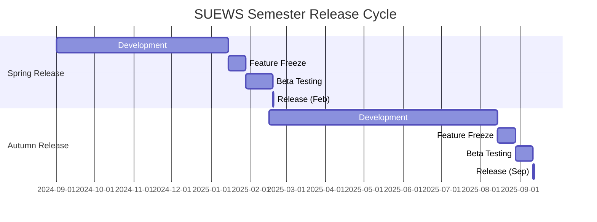

# SUEWS Release Management Plan

## Executive Summary

This document formalises the release strategy for SUEWS (Surface Urban Energy and Water balance Scheme) to address the diverse needs of academic users, non-academic partners, and developers. 

**Key Decisions:**
- **Versioning**: Date-based format `YEAR.MONTH.DAY[.dev]` (e.g., `2025.2.15`, `2025.8.8.dev`)
- **Release Cycle**: Two formal releases per year (February and September) aligned with academic semesters
- **Distribution**: All releases via PyPI, with development builds marked as pre-releases
- **Citation**: Zenodo DOI for each formal release to enable proper academic citation
- **Documentation**: Travels with code, version-specific
- **Breaking Changes**: Preferably in September release (start of academic year)
- **Implementation**: Starting September 2025

## 1. Versioning Strategy

### 1.1 Date-Based Versioning

SUEWS adopts a date-based versioning scheme:

```
YEAR.MONTH.DAY[.dev]
```

- **YEAR**: Full year (e.g., 2025)
- **MONTH**: Month of release (1-12)
- **DAY**: Day of release (1-31)
- **.dev**: Optional suffix for development builds

Examples:
- Formal release: `2025.2.15` (15 February 2025)
- Development build: `2025.8.8.dev` (8 August 2025 dev build)

### 1.2 Release Channels

#### Formal Releases (Stable)
- **Format**: `YYYY.M.D` (e.g., `2025.2.15`, `2025.9.1`)
- **Purpose**: Production-ready releases for operational use and academic publications
- **Testing**: Full regression testing, beta period, validation
- **Documentation**: Complete, version-specific documentation that moves with code
- **Citation**: Each release gets a Zenodo DOI for academic citation
- **Distribution**: PyPI

#### Development Releases
- **Format**: `YYYY.M.D.dev` (e.g., `2025.8.8.dev`)
- **Purpose**: Daily builds for developers and early adopters
- **Testing**: Automated CI/CD tests only
- **Documentation**: API documentation auto-generated
- **Support**: Community support via GitHub issues
- **Distribution**: PyPI only (tagged as pre-release)

### 1.3 Release Schedule

**Two formal releases per year aligned with academic semesters:**

#### February Release (Spring Semester)
- **Target Date**: Second week of February
- **Version Format**: `YYYY.2.DD` (e.g., `2025.2.15`)
- **Focus**: New features from autumn/winter development
- **Beta Period**: 3 weeks in January
- **Use Case**: Spring research projects, conference papers

#### September Release (Autumn Semester)
- **Target Date**: First week of September
- **Version Format**: `YYYY.9.DD` (e.g., `2025.9.1`)
- **Focus**: Stability for teaching, summer developments
- **Beta Period**: 2 weeks in late August
- **Breaking Changes**: Preferably introduced in this release
- **Use Case**: New academic year, teaching, PhD projects

## 2. Release Cadence

### 2.1 Regular Release Schedule

#### Semester Releases (Twice Yearly)

**February Release (Spring Semester)**
- **Development Period**: September-January
- **Feature Freeze**: Mid-January
- **Beta Testing**: 3 weeks (late January)
- **Release Date**: Second week of February
- **Focus**: New features, enhancements, research tools

**September Release (Autumn Semester)**
- **Development Period**: February-August  
- **Feature Freeze**: Mid-August
- **Beta Testing**: 2 weeks (late August)
- **Release Date**: First week of September
- **Focus**: Stability for teaching, breaking changes if needed
- **Note**: Major breaking changes should preferably be in this release

#### Development Releases
- **Frequency**: Daily automated builds
- **Trigger**: Any commit to master branch
- **Format**: `YYYY.M.D.dev`
- **Distribution**: PyPI only, marked as pre-release

### 2.2 Development Cycle



### 2.3 Academic Calendar Alignment

Releases strategically timed for academic workflow:
- **February Release**: Ready for spring semester research projects
- **September Release**: Stable version for new academic year and teaching
- **No releases during**: December (winter break), July-August (conference season)
- **Development builds**: Continuous throughout the year via PyPI

## 3. Quality Assurance Process

### 3.1 Testing Tiers

#### Tier 1: Automated Testing (Every Commit)
- Unit tests
- Integration tests
- Regression tests
- Performance benchmarks

#### Tier 2: Beta Testing (2 weeks)
- Community testing
- Research group validation
- Example case studies
- Documentation review

#### Tier 3: Release Candidate (1 week)
- Final validation
- Package integrity
- Installation testing
- Migration testing

### 3.2 Test Coverage Requirements

- **Stable Release**: >90% code coverage
- **Preview Release**: >80% code coverage
- **Development Build**: >70% code coverage

### 3.3 Benchmark Validation

All releases must pass:
- Standard benchmark cases
- Energy balance closure tests
- Historical comparison tests
- Platform compatibility tests

## 4. Documentation Strategy

### 4.1 Documentation Types

#### User Documentation
- Getting started guides
- Configuration references
- API documentation
- Tutorials and examples

#### Developer Documentation
- Contributing guidelines
- Architecture overview
- Testing procedures
- Release procedures

#### Scientific Documentation
- Model physics descriptions
- Parameterisation details
- Validation studies
- Citation guidelines

### 4.4 Academic Citation

#### DOI Assignment via Zenodo
- Each formal release receives a unique DOI
- Automatic archival for long-term preservation
- Machine-readable metadata for citations

#### Citation Format
Users should cite SUEWS as:
```
Sun, T., Grimmond, S., et al. (YYYY). SUEWS vYYYY.M.D. 
Zenodo. https://doi.org/10.5281/zenodo.XXXXXXX
```

#### BibTeX Entry
```bibtex
@software{suews_YYYY_M_D,
  author       = {Sun, Ting and Grimmond, Sue and others},
  title        = {SUEWS: Surface Urban Energy and Water Balance Scheme},
  month        = M,
  year         = YYYY,
  version      = {YYYY.M.D},
  doi          = {10.5281/zenodo.XXXXXXX},
  url          = {https://github.com/UMEP-dev/SUEWS}
}
```

### 4.2 Version-Specific Documentation

- Documentation travels with code (same repository)
- Each formal release has corresponding documentation
- Version switcher on documentation site
- Legacy documentation archived but accessible
- Development builds use latest documentation

### 4.3 Documentation Release Process

1. **Development Phase**: Update inline documentation
2. **Feature Freeze**: Documentation review begins
3. **Beta Period**: Community documentation feedback
4. **Release**: Final documentation published
5. **Post-release**: Tutorial updates, FAQ additions

## 5. Distribution Channels

### 5.1 Package Repositories

#### PyPI (Python Package Index)
- **Stable releases**: Immediate publication
- **Preview releases**: Published with pre-release flag
- **Installation**: `pip install supy`

#### Development Builds on PyPI
- **Daily builds**: Automated builds with `.dev` suffix
- **Installation**: `pip install --pre supy`  (to include pre-releases)
- **Note**: No separate TestPyPI, all releases go to PyPI

#### Conda-Forge
- **Stable releases**: Within 1 week of PyPI release
- **Installation**: `conda install -c conda-forge supy`

### 5.2 Source Distribution

#### GitHub Releases
- Source tarballs
- Release notes with changelog
- Binary wheels for major platforms

#### Zenodo Integration
- **DOI Assignment**: Each formal release gets a DOI
- **Citation**: Enables proper academic citation
- **Archive**: Permanent archival of releases
- **Metadata**: Author list, version, description
- Release notes
- Binary wheels for major platforms
- Changelog highlights

#### Docker Images
- Official SUEWS images
- Development environments
- Tutorial containers

## 6. Communication Plan

### 6.1 Release Announcements

#### Channels
- SUEWS mailing list
- GitHub Releases page
- UMEP forum
- Social media (Twitter/X, LinkedIn)
- Academic networks

#### Content
- Version number and release date
- Key features and improvements
- Breaking changes (if any)
- Migration guides
- Acknowledgements

### 6.2 Pre-release Communication

#### Beta Announcement
**February Release**: 3 weeks before (mid-January)
**September Release**: 2 weeks before (mid-August)
- Call for testing
- Known issues
- Feedback channels
- Testing priorities
- Installation instructions for dev version

### 6.3 Breaking Changes Policy

- **Preferred Timing**: September release (start of academic year)
- **Deprecation Period**: Minimum 1 year (2 release cycles)
- **Warning Messages**: Added in first deprecation cycle
- **Migration Guides**: Published with deprecation
- **Communication**: Announced well in advance via mailing list

## 7. Branching Strategy

### 7.1 Git Branch Model

```
master           ─────●─────●─────●───── (development)
                      ╱     ╱     ╱
release/2025.1  ─────●─────●─────●───── (release branch)
                           ╱
hotfix/2025.1.1 ─────────●───────────── (hotfix branch)
```

### 7.2 Branch Types

#### master
- Active development
- Next minor release features
- Continuous integration

#### release/X.Y
- Release preparation
- Bug fixes only
- Documentation updates
- Created at feature freeze

#### hotfix/X.Y.Z
- Critical fixes for released versions
- Cherry-picked to master
- Minimal changes

### 7.3 Tagging Convention

- Formal release tags: `YYYY.M.D` (e.g., `2025.2.15`, `2025.9.1`)
- Development tags: `YYYY.M.D.dev` (e.g., `2025.8.8.dev`)
- No separate beta/RC tags - use dev builds during testing period

## 8. Implementation Timeline

### Transition Starting September 2025

#### Phase 1: September 2025 Release
- [ ] Implement date-based versioning (2025.9.1)
- [ ] Set up Zenodo DOI integration
- [ ] Establish PyPI daily dev builds
- [ ] Create first semester release

#### Phase 2: Autumn 2025 (Oct-Dec)
- [ ] Refine release automation
- [ ] Gather feedback on new versioning
- [ ] Prepare for February 2026 release
- [ ] Document migration process

#### Phase 3: February 2026 Release
- [ ] Second semester release (2026.2.x)
- [ ] Full automation in place
- [ ] Beta testing programme established
- [ ] Documentation versioning active

#### Phase 4: Review and Adjust (Spring 2026)
- [ ] Evaluate two-release cycle
- [ ] Adjust based on user feedback
- [ ] Plan long-term support strategy
- [ ] Finalise contributor guidelines

## 9. Roles and Responsibilities

### 9.1 Release Manager
- Coordinate release schedule
- Manage feature freeze
- Oversee testing phases
- Publish releases
- Communication coordination

### 9.2 Core Developers
- Feature development
- Code review
- Bug fixes
- Documentation updates
- Testing support

### 9.3 Community Contributors
- Feature suggestions
- Bug reports
- Beta testing
- Documentation feedback
- Translation support

### 9.4 Scientific Advisory Board
- Model validation
- Physics review
- Research priorities
- Publication coordination

## 10. Tools and Automation

### 10.1 Continuous Integration
- GitHub Actions for automated testing
- Platform matrix: Linux, macOS, Windows
- Python versions: 3.9-3.13
- Fortran compilers: gfortran, ifort

### 10.2 Release Automation
- Automated version bumping
- Changelog generation
- Package building
- PyPI/TestPyPI deployment
- Documentation deployment

### 10.3 Quality Tools
- pytest for testing
- codecov for coverage
- ruff for linting
- black for formatting
- mypy for type checking

## 11. Success Metrics

### 11.1 Release Quality
- Regression test pass rate: >99%
- Critical bugs in release: <2
- Documentation completeness: >95%
- Installation success rate: >98%

### 11.2 Process Efficiency
- Release on schedule: >90%
- Beta participation: >20 testers
- Issue resolution time: <1 week
- Documentation update lag: <2 days

### 11.3 User Satisfaction
- Download growth: >10% per quarter
- User retention: >80%
- Community contributions: >5 per release
- Citation rate: Track academic usage

## 12. Risk Management

### 12.1 Technical Risks
- **Risk**: Breaking changes in dependencies
- **Mitigation**: Pin critical dependencies, test matrix

- **Risk**: Platform-specific bugs
- **Mitigation**: Comprehensive CI/CD, beta testing

### 12.2 Process Risks
- **Risk**: Release delays
- **Mitigation**: Buffer time, feature prioritisation

- **Risk**: Insufficient testing
- **Mitigation**: Extended beta period, automated tests

### 12.3 Community Risks
- **Risk**: Low adoption of new versions
- **Mitigation**: Clear migration guides, backwards compatibility

- **Risk**: Fragmented user base
- **Mitigation**: LTS support, gradual deprecation

## Appendices

### Appendix A: Release Checklist

#### Pre-release (2 weeks before)
- [ ] Feature freeze implemented
- [ ] Version number updated
- [ ] Changelog drafted
- [ ] Documentation reviewed
- [ ] Beta announcement sent

#### Release Day
- [ ] Final tests passed
- [ ] Packages built
- [ ] PyPI upload completed
- [ ] GitHub release created
- [ ] Announcement sent

#### Post-release (1 week after)
- [ ] User feedback collected
- [ ] Hotfix needs assessed
- [ ] Documentation updates
- [ ] Metrics reviewed
- [ ] Next release planned

### Appendix B: Version Compatibility Matrix

| SUEWS Version | Python | NumPy | Fortran Compiler |
|---------------|--------|-------|------------------|
| 2025.2.x      | 3.9-3.13 | ≥2.0 | gfortran ≥9     |
| 2025.9.x      | 3.10-3.14 | ≥2.0 | gfortran ≥10   |
| 2026.2.x      | 3.10-3.14 | ≥2.0 | gfortran ≥10   |
| 2026.9.x      | 3.11-3.15 | ≥2.0 | gfortran ≥11   |

### Appendix C: Communication Templates

#### Release Announcement Template
```
Subject: SUEWS vYYYY.M.D Released

We are pleased to announce the release of SUEWS vYYYY.M.D.

Key Features:
- Feature 1
- Feature 2
- Bug fixes

Installation:
pip install --upgrade supy

Documentation:
https://suews.readthedocs.io/

Changelog:
https://github.com/UMEP-dev/SUEWS/releases/tag/YYYY.M.D

Citation:
Please cite this version using DOI: 10.5281/zenodo.XXXXXXX

Thank you to all contributors!
```

### Appendix D: Migration Guide Template

```markdown
# Migrating from SUEWS vX to vY

## Breaking Changes
- Change 1: Description and migration steps
- Change 2: Description and migration steps

## Deprecated Features
- Feature 1: Replacement suggestion
- Feature 2: Timeline for removal

## New Requirements
- Dependency changes
- System requirements

## Migration Script
```python
# Automated migration script if applicable
```
```

---

*This document is version 1.0, last updated: August 2025*
*Review cycle: Annually (December)*
*Owner: SUEWS Development Team*
*Next review: Development meeting for September 2025 implementation*